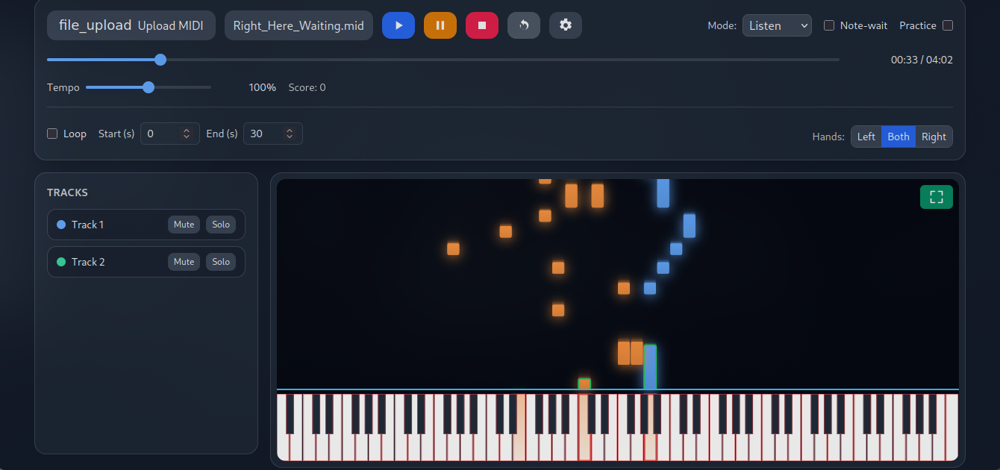

<p align="center">
  
  <br/>
  <h1 align=center>LearnPiano</h1>
  <h2 align=center>Web MIDI Piano Trainer</h2>
 </p>


<p align="center">
  
</p>


A modern, browser-based MIDI piano trainer built with Tailwind CSS, Tone.js, and the Web MIDI API. Load any MIDI file, visualize falling notes with piano roll, connect your MIDI keyboard for interactive practice, and track your progress.


---

## Features

- MIDI file loader (drag & drop via Upload) + "Load Previous" (persists last song in localStorage)
- MIDI controls (Play, Pause, Stop, Restart)
- Piano roll visualization
  - Hand-based colors (Left = Blue, Right = Orange)
  - Optional trails, adjustable fall time, note border radius, and bounce visuals
  - Virtual keyboard with track-colored glow and red outlines for visibility
- Audio & timing via Tone.js
  - Per-track polysynth playback
  - Tempo slider scales BPM (keeps visuals in sync)
- Web MIDI input & output
  - Detect and select MIDI In/Out devices
  - MIDI Thru (echo input to output)
  - Test Note button to validate connections
  - Channel-aware output for notes; sustain pedal (CC64) mirrored to output
  - Configurable Sustain Tail (ms) for external output note-offs to reduce choppiness
  - Panic on Stop (sustain off + All Notes Off on all channels)
- Practice Mode (wait-for-user)
  - Note/Chord wait: pauses just before the next group of notes
  - Pulse UI on required notes; wrong notes flash; continues when all required notes are pressed
  - Hand isolation (Left/Right/Both), Loop section, Note-wait toggle
  - Countdown overlay before starting
- Preferences persisted in localStorage
  - Mode, Practice toggle, Note-wait, Metronome
  - Tempo factor, Note radius, Fall time, Trails, Bounce
  - Hand, Loop settings, Staff view
  - MIDI Thru, Sustain Tail, preferred MIDI In/Out IDs
  - Auto-load previous song on startup

---

## Quick Start


```sh
    npx serve
```

Open the app in Chrome or Edge or Firefox (Web MIDI supported). Grant MIDI permissions when prompted.

---

## Using the App

1. MIDI Settings 
   - Select your MIDI Input and Output devices
   - Toggle MIDI Thru to echo input to output
   - Click Test Note to verify the output device
   - Adjust Sustain Tail (0–150 ms) to smooth external device note-offs
2. Load a MIDI
   - Click Upload and select a `.mid/.midi` file
   - Or click the previous-song button (it shows the saved filename)
   - The last loaded file is auto-loaded on startup
3. Controls
   - Play ▶, Pause ⏸, Stop ⏹, Restart ⟳
4. Practice
   - Switch Mode to Practice (or toggle the Practice switch)
   - Enable Note-wait to pause at the next notes/chord
   - Choose Hand (Left/Right/Both), set Loop start/end (in seconds)
   - Start playback (countdown appears), and play the required notes to continue
   - At the end, see your accuracy and missed notes
5. Visualization
   - Adjust Note radius (Square/Soft/Pill), Fall time, Trails, and Bounce
   - Toggle Staff View in the Tracks panel

---

## How It Works

- MIDI parsing: `@tonejs/midi`
- Scheduling & audio: `Tone.Transport` + per-track `PolySynth`
- Tempo slider: scales `Tone.Transport.bpm` around the song’s original BPM (keeps visuals in sync)
- MIDI Out: mirrors scheduled note on/off using track channels; CC64 (sustain) is forwarded
- Sustain smoothing: external note-offs delayed by a small, configurable tail (ms)
- Practice Mode
  - Notes within 50 ms are grouped; playback pauses ~20 ms before the group
  - UI pulses required notes until they’re all pressed via MIDI Input
  - Resume is immediate to maintain sync

---


## Troubleshooting

- Web MIDI not showing devices
  - Use Chrome/Edge and run on HTTPS or `http://localhost`
  - Ensure OS sees your device, and it’s not grabbed exclusively by another app
  - Refresh device list in the MIDI Settings modal
- No sound from output device
  - Select the correct MIDI Output in settings
  - Use Test Note to verify
  - Try increasing Sustain Tail
- Timing feels off after tempo changes
  - The app adjusts BPM (not playback rate) so visual sync stays tight; re-check that tempo factor and metronome match expectations
- Stuck notes on external gear
  - Press Stop (sends sustain off + All Notes Off)

---

## Development

This is a static app—no build step required.
- Tailwind is loaded via CDN
- Tone.js and `@tonejs/midi` are imported as ESM from CDNs inside `script.js`
- Start a local server as described above and open `index.html`

PRs and ideas welcome: measure-aware loops, richer notation/staff view, more analytics, and achievements.

---

## License

MIT.

## Author: Hridhuun Savant ([Bumblebee-3 (Github)](https://github.com/Bumblebee-3), [Website](https://bumblebee-2008.github.io/))